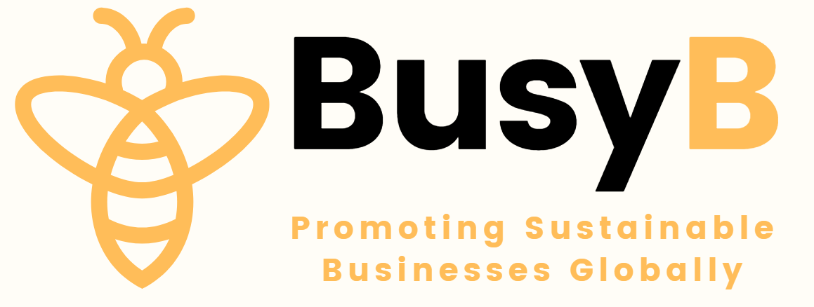
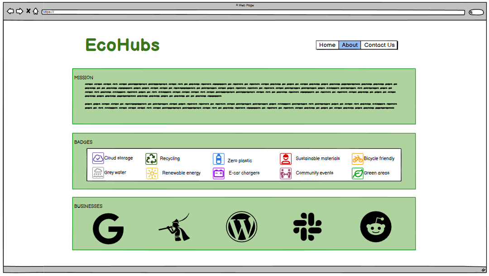
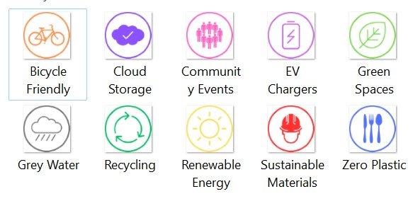
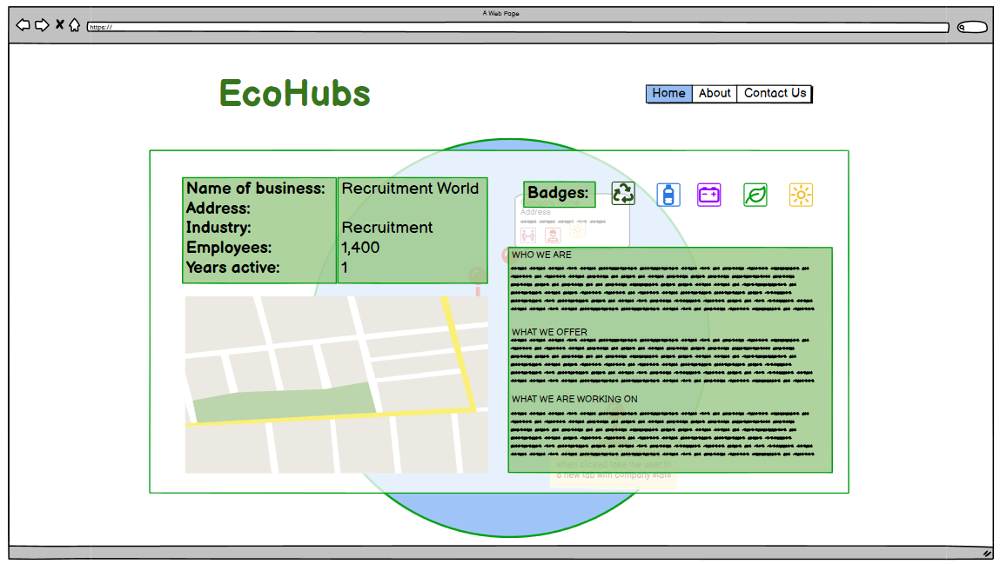
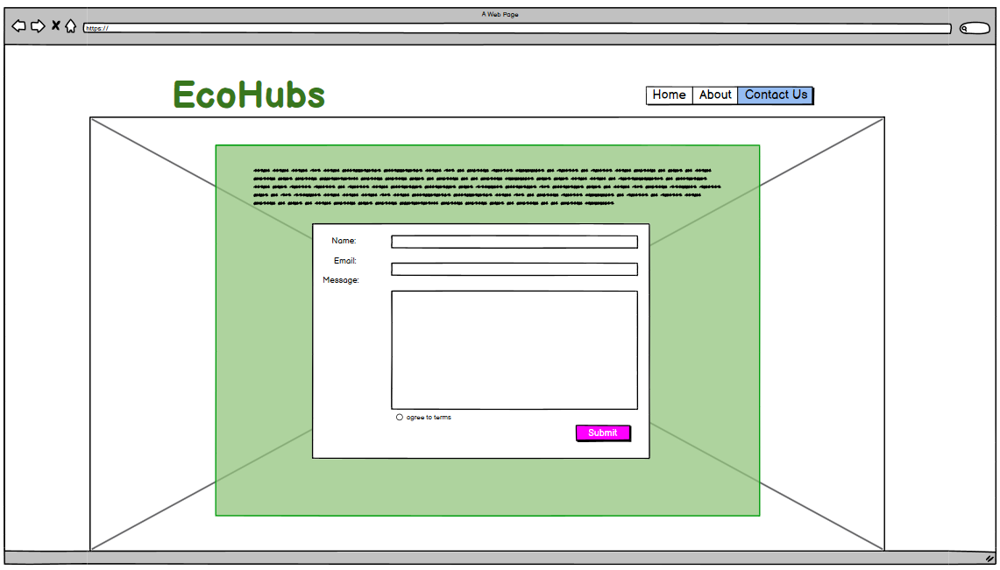
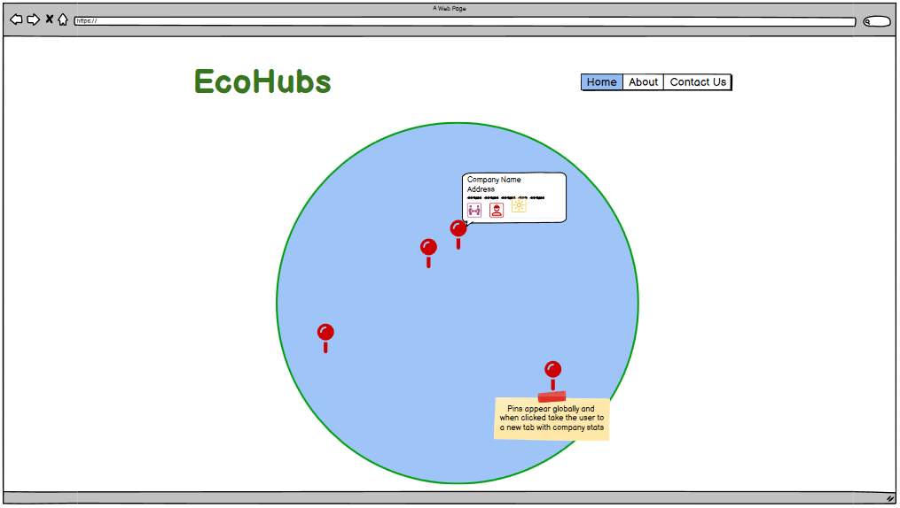

<h1 align="center" style="color:#ffbd59; font-weight:bold">BusyB </h1>
<h2 align="center" style="color:forestgreen;">EcoHub

<!--  -->

# SUBMISSION
## Deployment
This project is deployed in GitHub Pages and can be accessed at [ecoHub](https://shanedoyledev.github.io/EcoHub/).

# About BusyB and our ecoHub
## Intro
BusyB is an NGO that strives to help businesses of all sizes and industries in their quest towards a more sustainable world. To this end, we have created our ecoHub, a platform for companies to showcase their ESG initiatives to prospective investors, customers and current or potential employees. Our goal is to create a virtuous circle of friendly competition between companies that pushes them forward in their work.

In our ecoHub, companies can upload the details and images of their initiatives. Once our team has reviewed and approved the content, the company will receive a badge for these that will be displayed on their profile. These badges work with a double purpose. Fist, they are a token for companies to collect and boast, both internally in their newsletters, email signatures, etc. and externally in their traditional and social media platforms. Second, they are a quick and easy visual cue for anyone seeing them to gauge and assign a value to the contributions that the company is making, and whether these align with their areas of concern.

## Goal

ESG has increasingly become a key focus point for businesses, who dedicate more and more resources into them, but also lack a tool to leverage this investment as an attractive feature. At the same time, consumers of goods and services, investors and jobseekers don't have a clear-cut, easy, at-a-glance way of learning about the initiatives undertaken by these companies, who, more often than not, end up burying ESG reports deep in their corporate websites.

With all this in mind, BusyB has created ecoHub, an open platform for businesses to display their work around ESG and for visitors of all backgrounds to be able to make better informed decisions when purchasing goods or services, applying for or accepting positions from prospective employers, or investing their funds into.

## Tech
In the tech section, we provide information about the technology stack, dependencies, and any technical details related to the project.

### Languages:
 - HTML
 - CSS
 - JavaScript
 - Python 🐍

### Frameworks, Libraries, APIs and Hosting:

- 🌐 [Heroku](https://www.heroku.com/) was used to deploy the project.
- 🌐 [Amazon Web Services (AWS)](https://aws.amazon.com/) was used for external file storage.
- 🌐 [Mapbox](https://www.mapbox.com/) API was used to render the map.
- 🌐 [Django](https://www.djangoproject.com/) is the framework used to build the app.
- 🌐 [Elephant SQL](https://www.elephantsql.com/) provides the hosting for the database.
- 🌐 [Bootstrap v.5](https://getbootstrap.com/) was used for the styling in our page.
- 🌐 [JQuery](https://jquery.com/) was used as a dependency of Bootstrap.

## Wireframes

## Credits
We would like to give credit to the following individuals, organizations, and resources that have contributed to the project or provided inspiration: