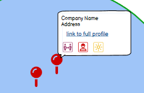

<h1 align="center" style="color:#ffbd59; font-weight:bold">BusyB </h1>
<h2 align="center" style="color:forestgreen;">EcoHub

# About BusyB and EcoHub

## Introduction

BusyB is a fictional NGO conceived during Soda Social's Hackathon. Our primary mission is to assist businesses—from startups to large enterprises—on their journey toward environmental, social, and governance (ESG) sustainability. To facilitate this, we've developed EcoHub, a groundbreaking platform where companies can showcase their ESG initiatives to potential investors, consumers, and prospective employees. Our aim is to spark a virtuous cycle of competition among businesses that propels them toward greater sustainability.

In EcoHub, companies can submit details and visuals of their green initiatives. Once our team reviews and approves this content, the participating company receives a unique badge, which is then showcased on their profile. These badges serve two essential functions: 
1. They act as bragging rights that companies can feature internally—via newsletters, email signatures, etc.—and externally through traditional and social media.
2. They provide an immediate visual cue for viewers to quickly assess a company's contributions, enabling them to align their choices with their own sustainability values.

## Goal

In recent years, ESG considerations have become a focal point for businesses, drawing more resources and attention. However, a coherent platform to highlight these endeavors has been conspicuously absent. On the flip side, consumers, investors, and job seekers often find it challenging to quickly gauge a company's ESG commitments, which are usually buried deep within corporate websites.

Recognizing this gap, BusyB has designed EcoHub to be an open platform for businesses to publicly display their ESG efforts. It allows people from various walks of life to make more informed decisions, whether they're buying products, seeking employment, or investing.

## Technology

In this section, we delve into the technical nitty-gritty of EcoHub. Here, you'll find information about the technology stack we employ, the dependencies required, and other pertinent technical details related to the project.

### Languages:
 - HTML 
 - CSS
 - JavaScript
 - Python 

### Frameworks, Libraries, APIs and Hosting:

- 🌐 [GitHub Pages](https://github.com/) was used to deploy the project.
- 🌐 [Mapbox](https://www.mapbox.com/) API was used to render the map.
- 🌐 [Bootstrap v.5](https://getbootstrap.com/) was used for the styling in our page.
- 🌐 [JQuery](https://jquery.com/) was used as a dependency of Bootstrap.

## Wireframes

## Deployment
This project is deployed in GitHub Pages and can be accessed at [ecoHub](https://shanedoyledev.github.io/ecohub/).

## Credits
We would like to give credit to the following individuals, organizations, and resources that have contributed to the project or provided inspiration:
